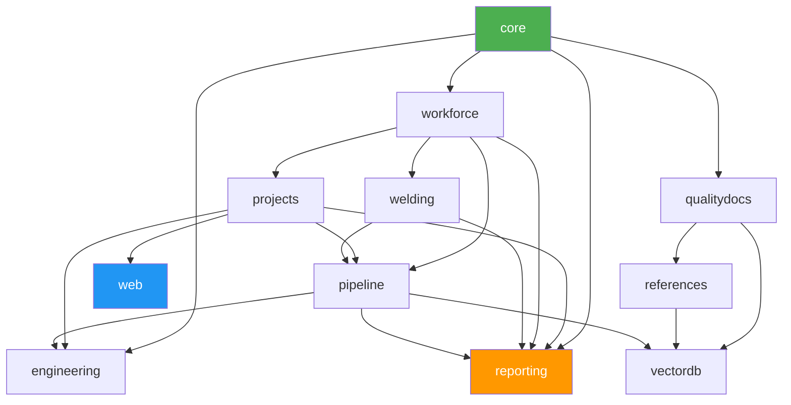

# QMS Second Brain

> Quality Management System — Development Knowledge Base

## Quick Links
- [[Module Index]] — All QMS modules at a glance
- [[Architecture Overview]] — System design and dependency graph
- [[Database Overview]] — 220+ tables and cross-module FK map
- [[API Overview]] — REST API endpoint reference
- [[Plugin Setup Guide]] — Recommended Obsidian plugins

---

## Module Status

```dataview
TABLE
  cli_name AS "CLI",
  status AS "Status",
  length(commands) AS "Commands",
  length(tables) AS "Tables",
  length(depends_on) AS "Deps"
FROM "01-QMS-Modules"
WHERE contains(tags, "qms-module")
SORT status ASC, module ASC
```

## Recently Updated Notes

```dataview
TABLE updated AS "Updated", tags AS "Tags"
FROM ""
WHERE updated
SORT updated DESC
LIMIT 10
```

## Pending Work

```dataview
TASK
FROM "01-QMS-Modules"
WHERE !completed
```

## Module Dependency Graph



---

## Vault Statistics
- **Modules:** 11 (10 Complete, 1 Pending)
- **CLI Commands:** 35 across 9 modules
- **Database Tables:** 220+
- **API Endpoints:** 30+ REST routes
- **Project Stages:** 9
