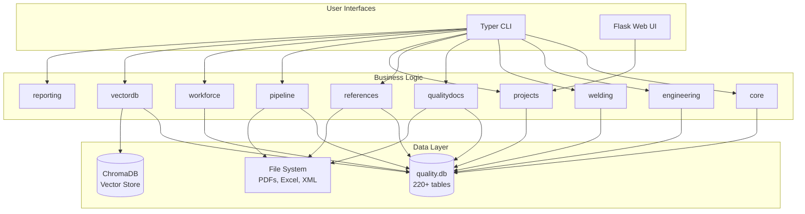
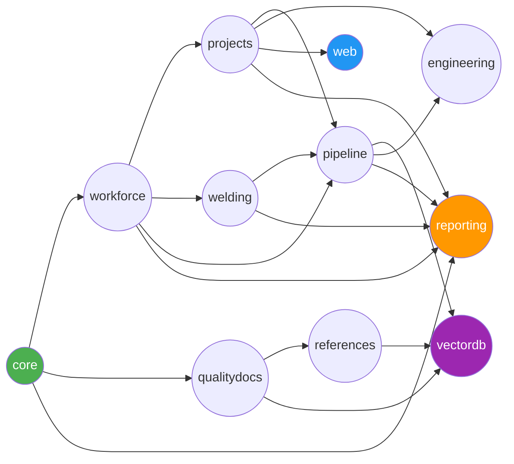
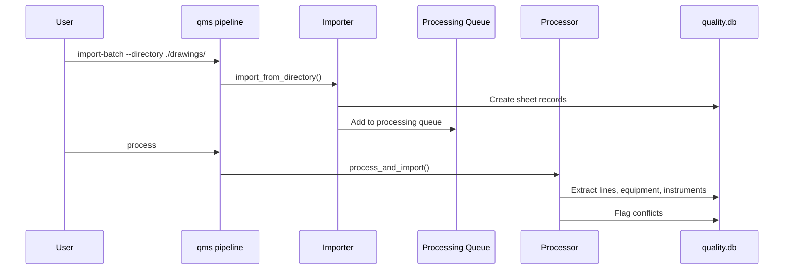
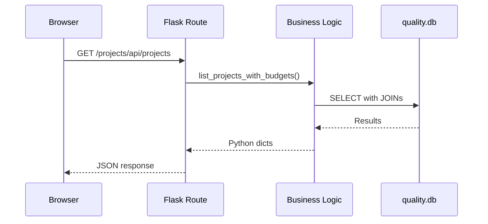

# Architecture Overview

## Design Philosophy

QMS follows a **monolithic modular** architecture:
- **Single SQLite database** (`quality.db`) — 220+ tables, single source of truth
- **Modular Python packages** — each module owns its schema, business logic, and CLI
- **Clean layer separation** — CLI (Typer) → Business Logic → Database (SQLite)
- **Optional web layer** — Flask app factory with thin API routes

## System Architecture



## Module Dependency Graph



## Schema Dependency Order (FK Chain)

Migrations must run in this order to satisfy foreign key constraints:

```
1. core          → audit_log, attachments, notes
2. workforce     → departments, roles, employees, ...
3. projects      → business_units, projects, jobs, budgets, ...
4. qualitydocs   → qm_modules, qm_sections, qm_procedures, ...
5. references    → qm_references, ref_clauses, ref_procedure_links, ...
6. welding       → weld_welder_registry, weld_wps, weld_wpq, ...
7. pipeline      → sheets, lines, equipment, electrical_*, plumbing_*, ...
8. engineering   → eng_calculations, eng_validations
```

## Key Design Decisions

| Decision | Rationale |
|----------|-----------|
| Single SQLite DB | Simplicity, zero-config, portable, ACID transactions |
| Polymorphic audit/notes | Any entity can be audited or annotated without schema changes |
| Business logic isolation | No Flask imports in module code — testable without web dependencies |
| Shared `business_units` | Replaced per-module department tables; single source for org structure |
| FTS5 virtual tables | Full-text search without external search engine |
| ChromaDB for vectors | Separate store optimized for similarity search |
| SCHEMA_ORDER list | Explicit FK dependency chain prevents migration errors |

## Data Flow Patterns

### SIS Extraction Flow


### Web Request Flow


## File Organization

```
D:\qms\
├── core/           # Foundation (db, config, logging)
├── api/            # Flask blueprints (thin delivery layer)
├── frontend/       # Templates + static assets
├── engineering/    # Calculations + vendored refrig_calc
├── welding/        # Welding program management
├── qualitydocs/    # Quality manual content
├── references/     # External standards
├── projects/       # Project + budget management
├── pipeline/       # SIS extraction pipeline
├── workforce/      # Employee registry
├── vectordb/       # Semantic search
├── reporting/      # Cross-module reports (stub)
├── cli/            # Typer CLI entry point
├── tests/          # 142 tests
└── data/           # Runtime data (git-ignored)
```

## Related Notes
- [[Home]] — Dashboard
- [[Database Overview]] — Full schema documentation
- [[API Overview]] — REST endpoint reference
