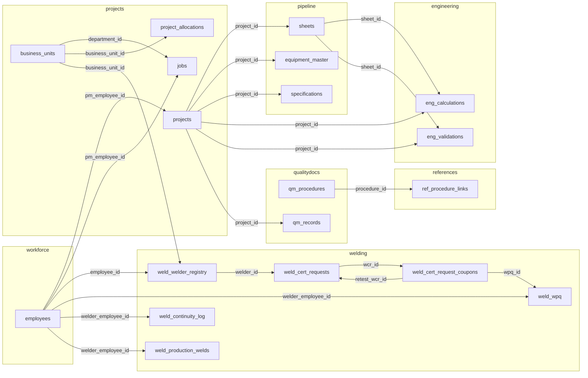

# Database Overview

> **Single database:** `D:\qms\data\quality.db` — SQLite with WAL mode
> **Total tables:** 260+ across 9 schema files

## Table Count by Module

| Module | Tables | Schema File |
|--------|--------|------------|
| [[core]] | 3 | `core/schema.sql` |
| [[workforce]] | 10 | `workforce/schema.sql` |
| [[projects]] | 14 | `projects/schema.sql` |
| [[qualitydocs]] | 14 | `qualitydocs/schema.sql` |
| [[references]] | 8 | `references/schema.sql` |
| [[welding]] | 56 | `welding/schema.sql` |
| [[pipeline]] | 152+ | `pipeline/schema.sql` |
| [[engineering]] | 2 | `engineering/schema.sql` |
| [[automation]] | 1 | `automation/schema.sql` |
| **Total** | **~260** | |

## Cross-Module Foreign Keys

This is the **interconnection map** — these FKs create the dependency web between modules:

## Shared Tables

### `business_units` (Owner: [[projects]])
Used by: [[projects]] (jobs, allocations), [[welding]] (welder_registry), [[pipeline]]

| Column | Type | Description |
|--------|------|-------------|
| id | INTEGER PK | Auto-increment |
| code | TEXT UNIQUE | 3-digit code (e.g., 230, 730, 800) |
| name | TEXT | Short name |
| full_name | TEXT | Full department name |
| manager | TEXT | Manager name |
| status | TEXT | active/inactive |

### `employees` (Owner: [[workforce]])
Referenced by 8+ tables across 3 modules.

### `projects` (Owner: [[projects]])
Referenced by 10+ tables across 4 modules.

### `sheets` (Owner: [[pipeline]])
Referenced by 100+ discipline-specific tables plus engineering.

## Full-Text Search Tables (FTS5)

| FTS Table | Module | Searches |
|-----------|--------|----------|
| `qm_content_fts` | [[qualitydocs]] | Quality manual content |
| `ref_clauses_fts` | [[references]] | Reference clause summaries |
| `ref_content_fts` | [[references]] | Reference content blocks |

## Self-Referencing Tables

| Table | Column | Purpose |
|-------|--------|---------|
| `employees` | `supervisor_id` | Supervisor hierarchy |
| `ref_clauses` | `parent_clause_id` | Clause nesting |
| `sheets` | `supersedes` / `superseded_by` | Revision chain |
| `qm_procedures` | `supersedes_id` | Procedure revision chain |

## Notable Columns Added via Migration

| Table | Column | Type | Default | Purpose |
|-------|--------|------|---------|---------|
| `project_allocations` | `is_gmp` | INTEGER | 0 | GMP contract flag (per-job) |
| `budget_settings` | `gmp_weight_multiplier` | REAL | 1.5 | Weight multiplier for GMP jobs in projections |
| `projects` | `is_gmp` | INTEGER | 0 | Legacy (unused — GMP moved to allocation level) |

> Migration: `migrate_add_project_gmp()` in `projects/migrations.py`

## Automation & Cert Request Tables (New)

### `automation_processing_log` (Owner: [[automation]])
Generic audit trail for JSON request processing.

| Column | Type | Description |
|--------|------|-------------|
| id | INTEGER PK | Auto-increment |
| file_name | TEXT | Original JSON filename |
| request_type | TEXT | JSON `"type"` field value |
| status | TEXT | `pending`, `processing`, `success`, `failed` |
| handler_module | TEXT | Module that handled the request |
| result_summary | TEXT | Handler output summary |
| error_message | TEXT | Error details on failure |
| source_json | TEXT | Full JSON content |
| processed_at | TEXT | Completion timestamp |
| created_at | TEXT | Row creation timestamp (auto) |

### `weld_cert_requests` (Owner: [[welding]])
Weld certification test requests with lifecycle tracking.

| Column | Type | Description |
|--------|------|-------------|
| id | INTEGER PK | Auto-increment |
| wcr_number | TEXT UNIQUE | Format: `WCR-YYYY-NNNN` |
| welder_id | INTEGER FK | References `weld_welder_registry(id)` |
| employee_number | TEXT | Welder employee number |
| welder_name | TEXT | Welder full name |
| welder_stamp | TEXT | Welder stamp |
| project_number | TEXT | Associated project |
| project_name | TEXT | Project name |
| status | TEXT | `pending_approval` / `approved` / `testing` / `results_received` / `completed` / `cancelled` |
| is_new_welder | INTEGER | Auto-registered during intake |
| approved_by | TEXT | Approver name |

> Indexes: `idx_wcr_status`, `idx_wcr_welder`, `idx_wcr_project`

### `weld_cert_request_coupons` (Owner: [[welding]])
Individual test coupons within a WCR, with test results and WPQ linkage.

| Column | Type | Description |
|--------|------|-------------|
| id | INTEGER PK | Auto-increment |
| wcr_id | INTEGER FK | References `weld_cert_requests(id)` ON DELETE CASCADE |
| coupon_number | INTEGER | Sequence within WCR (1-4) |
| process | TEXT | SMAW, GTAW, GMAW, FCAW, SAW, GTAW/SMAW |
| position | TEXT | Test position (e.g., 6G) |
| wps_number | TEXT | WPS being qualified against |
| status | TEXT | `pending` / `testing` / `passed` / `failed` / `wpq_assigned` / `retest_scheduled` |
| test_result | TEXT | `pass` or `fail` |
| wpq_id | INTEGER FK | References `weld_wpq(id)` — set when WPQ is created from passed coupon |
| retest_wcr_id | INTEGER FK | References `weld_cert_requests(id)` — links to retest WCR for failed coupons |

> Indexes: `idx_wcr_coupon_wcr`, `idx_wcr_coupon_status`
> Unique constraint: `(wcr_id, coupon_number)`

## Dynamic Tables (Created at Runtime)

| Table | Created By | Purpose |
|-------|-----------|---------|
| `jobsites` | `pipeline/processor.py` | Legacy project sites |
| `embed_queue` | `vectordb/embedder.py` | Embedding job queue |

## Related Notes
- [[Architecture Overview]] — Schema dependency order
- [[core]] — `get_db()`, `migrate_all()`, SCHEMA_ORDER
